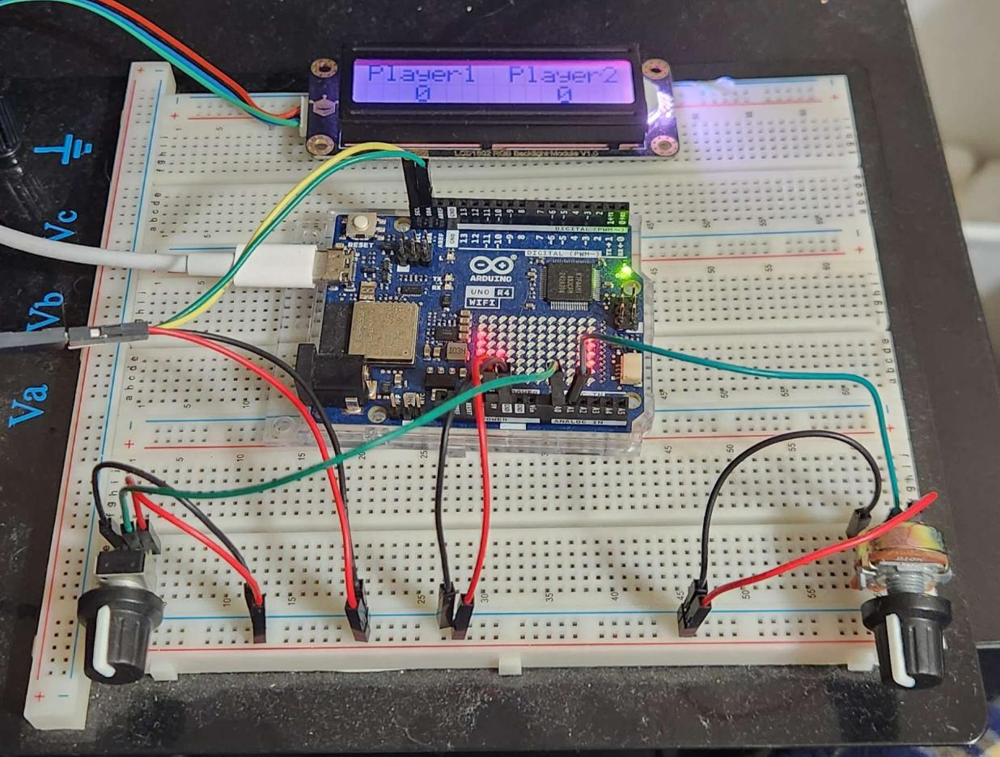
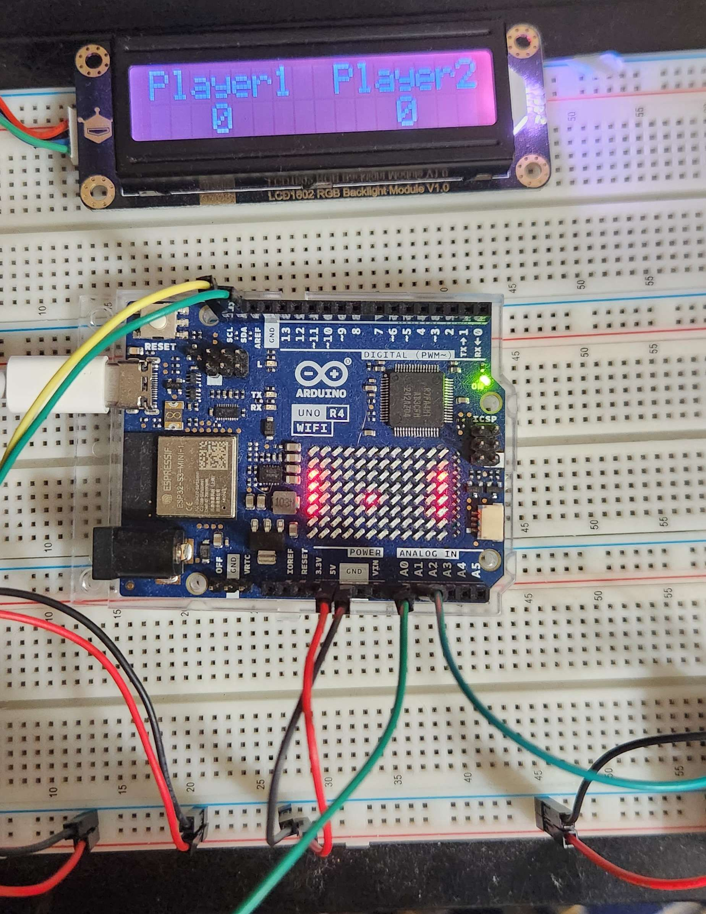

# Pong Clone

This is a simple pong clone developed for the Arduino Uno R4. It uses the 8x12 LED matrix built into the device to display the game.

## Required Parts

- 2 10k Potentiometers
- Arduino Uno R4 WiFi
- Jumper Cables
- Breadboard

## Optional

- 1602 LCD Display (comment out lcd code if unavailable) 
    - Libraries:
    - LiquidCrystal_I2C (For this one, I used the AIP31068 version)
    - PCA9633.h

## Files

- pong_clone.ino:   The main file
- animations.h:     Contains animation for when someone wins

## Demo

